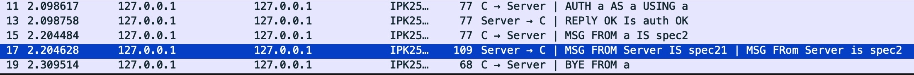
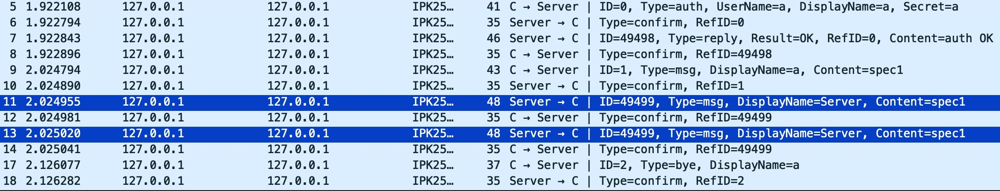
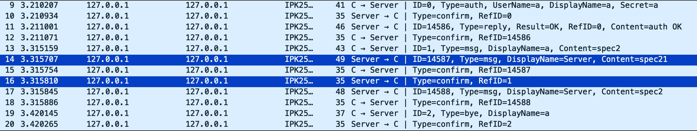
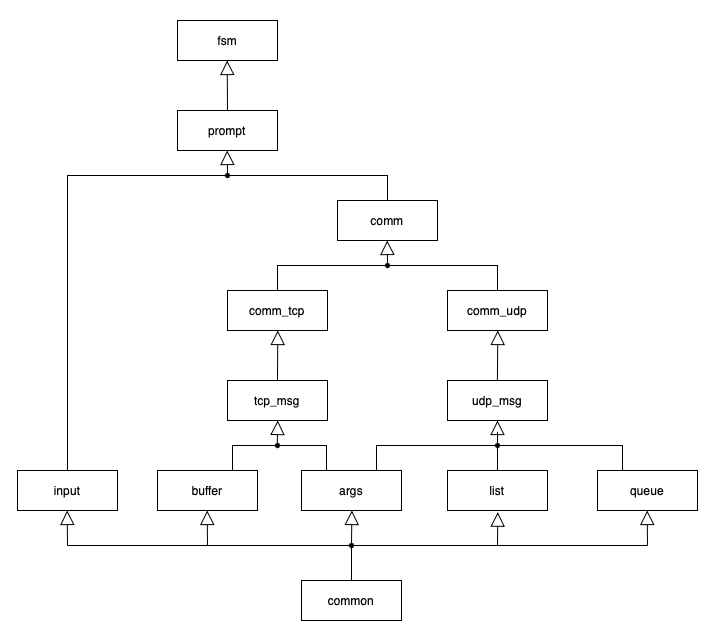
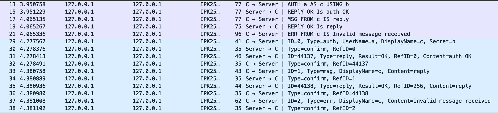

# IPK Project 2

## Introduction
This project is a chat client using the `IPK25-CHAT` protocol to communicate, implementing its `TCP` and `UDP` variants. Further information about this protocol can be found [here](https://git.fit.vutbr.cz/NESFIT/IPK-Projects/src/branch/master/Project_2). The program supports IPv4 network layer protocol. Upon execution, it uses the specified protocol variant and allows communication with the server.

## Table of Contents
- [IPK Project 2](#ipk_2)
    - [Table of Contents](#table-of-contents)
    - [Execution](#execution)
        - [Example Execution](#example-execution)
    - [Usage](#usage)
    - [Communication](#communication)
        - [TCP Communication](#tcp-communication)
            - [Challenges](#challenges)
            - [Solution](#solution)
        - [UDP Communication](#udp-communication)
            - [Challenges](#challenges-1)
            - [Solution](#solution-1)
    - [Implementation Overview](#implementation-overview)
        - [File Overview](#file-overview)
    - [Testing](#testing)
        - [Testing Enviroment](#testing-environment)
        - [Test Suits](#test-suits)
        - [Valid Input Test Case Structure](#valid-input-test-case-structure)
        - [Python Server](#python-server)
        - [Wireshark](#wireshark)
    - [Biblipgraphy](#bibliography)

## Execution
The program can be compiled by running `make`, which will create the executable `ipk25chat-client`. Multiple options can be used; they are specified below.
```
./ipk25chat-client [-h] {-t protocol} {-s hostname} [-p server-port] [-d udp-timeout] [-r udp-retransmissions]
```

- `{}` - required
- `[]` - optional

| Option |Default | Description |
|--------|--------|-------------|
| `-h` |-       | Prints usage instructions and exits |
| `-t` |-       | Select protocl variant tcp/udp |
| `-s` |-       | Server IP or hostname |
| `-p` |`4567` | Server port |
| `-d` |`250` | UDP confirmation timeout (miliseconds) |
| `-r` |`3` | Number of UDP retransmissions |

### Example Execution
```
./ipk25chat-client -t udp -s localhost -p 3456 -r 2
```

## Usage
The user must authenticate with the `/auth` command; after successful authentification, the user can send messages to the server and join server channels. The program can be terminated using `CRTL+C` or `CRTL+D`. Below is a summary of supported client commands.

| Command | Parameters | Description |
|---------|------------|-------------|
| `/auth` | `{username}` `{secret}` `{display-name}` | Send authenetification request |
| `/join` | `{channel-id}` | Send join request to join a server channel |
| `/rename` | `{display-name}` | Change local display name |
| `/help` | -          | Prints list of client commands |

## Communication
Client Server Communication refers to exchanging data and Services among multiple processes. In Client client-server communication System one process acts as a client requesting a service or data, and Another process acts like a server for providing those Services or Data to the client machine. This communication model is widely used for exchanging data among various computing environments, such as distributed systems, Internet applications, and networking application communication.

### TCP Communication
`TCP` (Transmission Control Protocol) is one of the main protocols of the Internet protocol suite. It lies between the application and network layers, which provide reliable delivery services. It is a connection-oriented protocol for communications.

#### Challenges
Since `TCP` data is transported as a stream of bytes, the message can arrive in multiple segments or multiple messages in a single segment. This event is called `TCP` segmentation. The latter's case is visible on the packets captured below from the `test_15` test case.



#### Solution
In the `IPK25-CHAT` protocol specification, all valid `TCP` variant messages have `\r\n` at the end acting as a delimiter, which allows the client program to determine if the message received is complete.  
A message buffer is implemented to solve this challenge, where all incoming messages are concatenated with the contents of the buffer. If the buffer contains at least one complete message (`\r\n` is in the buffer), it is extracted and processed. The remaining buffer content must be concatenated with the following incoming message.

### UDP Communication
`UDP` (User Datagram Protocol) is a Transport Layer protocol. Unlike `TCP`, it is an unreliable and connectionless protocol. So, there is no need to establish a connection before data transfer. The `UDP` helps establish low-latency and loss-tolerating connections over the network. The `UDP` enables process-to-process communication.

#### Challenges
Since `UDP` is, by its nature, an unreliable communication protocol, packets can get lost, duplicated, or reordered.
- **Duplicities**: The case where duplicate messages are sent from the server is visible on the packets captured below from the `test_14` test case.
 
- **Reordering**: The case where messages come in different than expected order from the server is visible on the packets captured below from the `test_15` test case, where the client is waiting for a `CONFIRM` message but receives an `MSG` from the server that is confirmed first.
 

#### Solution
In the `IPK25-CHAT` protocol, `CONFIRM` messages confirm all sent messages from either side other than `CONFIRM`. The original message is resent if a corresponding confirm message does not arrive in time. This mechanism enables the use of `UDP` as a support protocol for the chat `IPK25-CHAT` protocol since it solves `UDP` unreliability.
- **Duplicities**: To solve duplicities, the client stores all message IDs of received messages, and an incoming message is only processed if it has a unique ID. Otherwise, it is considered a retransmission and is only confirmed using the `CONFIRM` message.
- **Reordering**: In the case mentioned above, where the client is waiting for a `CONFIRM` message but an `MSG` message arrived, the client stores this message in a queue, and when the awaited `CONFIRM` arrives, the previous action is considered as complete, and then the message is extracted from the queue and processed.

## Implementation Overview
This section describes the project's implementation details, including its structure, key components, and how different files interact to perform communication with the server.

The project is implemented in **C** and has a modular structure. The source files are in `src/`, and their corresponding header files are in `lib/`. Below is a diagram illustrating how the files are structured within the project, showing their relationships and interactions. 



**Note**: Created using draw.io.

### File Overview
This section describes the contents and responsibilities of the project files:
- **main.c**: Program's main entry, processing arguments, and coordinating execution.
- **fsm.c**: Implements FSM describing client behavior.
- **prompt.c**: Utilizes `select` to wait either for user input or a message from server while taking care of the 5s timeout when waiting for a response when necessary.
- **comm.c**: Serves as an interface to send and receive messages based on the selected protocol variant.
- **comm_tcp.c**: Implements functions to send and receive `TCP` protocol variant messages.
- **comm_udp.c**: Implements functions to send and receive `UDP` protocol variant messages.
- **tcp_msg.c**: Implements functions to build and parse `TCP` protocol variant messages.
- **udp_msg.c**: Implements functions to build and parse `UDP` protocol variant messages.
- **input.c**: Implements functions to process user input and print client help.
- **buffer.c**: Implements functions to deal with `TCP` segmentation.
- **args.c**: Processes and validates command-line arguments.
- **list.c**: Implements functions to deal with receiving duplicate messages in the `UDP` protocol variant.
- **queue.c**: Implements functions to deal with messages received while waiting for confirmation in the `UDP` protocol variant.
- **common.c**: Implements utility functions to validate message parts.

**Note**: ChatGPT was used to implement some functions and generate comments in the source code; this is also written in the source code comments of the corresponding functions.

## Testing
The testing process ensures the client functions correctly across different scenarios, including handling invalid inputs and comparing results against expected results. The test script can be executed by running `make test`.

### Testing Environment
- **Host Machine**: MacBook Pro running Lima (`limactl version 0.23.2`).
- **Test VM**: Referential virtual machine with nix-shell setup.
- **Tools Used**: 
  - `ipk25chat-client` (chat client being tested)
  - Python-based test script
  - Python-based server
  - Public reference Discord server

**Note**: ChatGPT was used to create both Python-based scripts.

### Test Suits
- #### Invalid Inputs
    - **Objective**: Ensure the client correctly rejects incorrect arguments.
    - **Expected Outcome**: The client should return an error for each invalid input.

- #### Valid Inputs
    - **Objective**: Confirm correct client behavior according to the FSM describing its behavior.
    - **Expected Outcome**: Output is specified individually in each test case.

### Valid Input Test Case Structure
- This is the `test_10` test case:
```
Reply in open state
EXIT CODE: 1
/auth a b c
reply
====
Action Success: auth OK
Action Success: reply
ERROR: 
```
- The first line contains a short description of the test
The second line optionally contains the exit code if skipped; `0` is the default value
- Line starting with `=` serves as a divider between test input and test output
- The expected output is matched using the Python `startswith` function
- Part of the test inputs can be a line with `KILL`, which results in sending a `SIGINT` signal to the client

### Python Server
A local Python server, `test/server.py`, was used for testing. The server's implementation of the FSM describing its behavior is located in the `ClientBase` class, with `UDPClient` and `TCPClient` inheriting methods from this class and adding methods for parsing, creating, and sending messages. The server is for testing purposes only since it responds unexpectedly when it receives specific messages. This is used to test all of the transitions from client FSM. For example, from the test case shown above, when the server receives a message with the content `reply`, it responds with a `REPLY` message, as shown in the expected output part of the test.  
The server uses `select` to wait for incoming `UDP` messages or `TCP` connections. When such an action occurs, respectively, `TCPClient` or `UDPClient` is created, and a new thread is started to handle the client using the `handle_udp_client` or `handle_tcp_client` function.

### Wireshark
Wireshark played a crucial part in testing and debugging this project. A provided custom `IPK25-CHAT` protocol dissector plugin for Wireshark was used to capture the communication between the client and the server. The communication between the client and the server during the above-mentioned `test_10` test case is shown in the picture below.



The first six packets captured show the `TCP` variant of the protocol, where it is visible that the `ABNF` grammar defining the `TCP` protocol variant is case-insensitive. The rest of the packets show the `UDP` protocol variant. Here, you can see that each message has its `ID` and has to be confirmed by the other side using a `CONFIRM` message.

## Bibliography
- GeekForGeeks, _Client Server Communication in Operating System_ [online]. December 2023. [cited 2025-04-20]. Available at: https://www.geeksforgeeks.org/client-server-communication-in-operating-system/
- GeekForGeeks, _Differences between TCP and UDP_ [online]. December 2024. [cited 2025-04-20]. Available at: https://www.geeksforgeeks.org/differences-between-tcp-and-udp/
- Dolejska, D. _IPK Project 2: Client for a chat server using the IPK25-CHAT protocol_ [online]. 2025. [cited 2025-04-20]. Available at: https://git.fit.vutbr.cz/NESFIT/IPK-Projects/src/branch/master/Project_2
- **[RFC5234]** Crocker, D. and Overell, P. _Augmented BNF for Syntax Specifications: ABNF_ [online]. January 2008. [cited 2025-04-10]. DOI: 10.17487/RFC5234. Available at: https://datatracker.ietf.org/doc/html/rfc5234
- **[RFC9293]** Eddy, W. _Transmission Control Protocol (TCP)_ [online]. August 2022. [cited 2025-04-20]. DOI: 10.17487/RFC9293. Available at: https://datatracker.ietf.org/doc/html/rfc9293
- **[RFC768]** Postel, J. _User Datagram Protocol_ [online]. March 1997. [cited 2025-04-20]. DOI: 10.17487/RFC0768. Available at: https://datatracker.ietf.org/doc/html/rfc768
- **[ChatGPT]** OpenAI. ChatGPT [online]. 2025. Available at: https://chat.openai.com
- **[Grammarly]** Grammarly Inc. Grammarly [online]. 2025. Available at: https://www.grammarly.com
- **[draw.io]**. diagrams.net [online]. 2025. Available at: https://www.diagrams.net